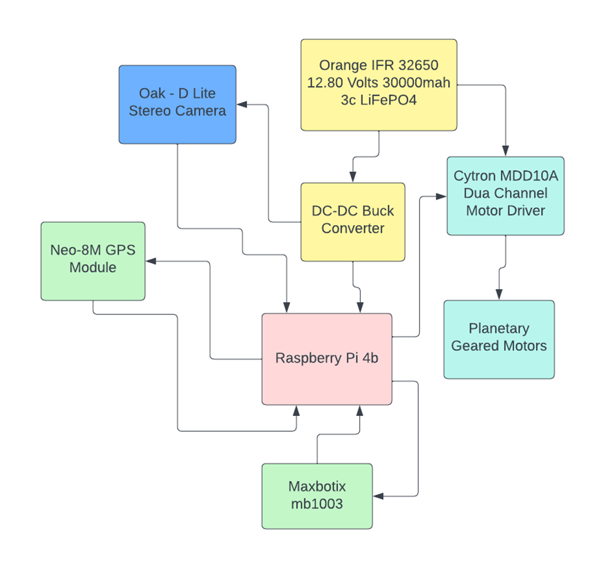

# Autonomous-Rover
Designed and developed an advanced omnidirectional rover with inverted double-lambda suspension and six Swedish  omnidirectional wheels, enabling autonomous navigation using stereo vision and SLAM.
# Autonomous Rover Navigation System

This project presents an autonomous rover system with advanced navigation and obstacle avoidance capabilities using stereo vision, GPS, and ultrasonic sensors. The control system is powered by a Raspberry Pi and integrates multiple sensors and algorithms to enable smart, real-time decision-making in challenging environments.

---

## 🚀 Features

### 🧠 Control Logic

- **Obstacle Avoidance**
  - Utilizes the **OAK-D stereo camera** for real-time depth perception.
  - Capable of detecting and avoiding obstacles using stereo vision and AI-based processing.
  - Includes **dual Maxbotix MB1003 ultrasonic sensors** for close-range detection and redundancy.

- **Navigation**
  - Powered by the **Neo M8N GPS module** for high-accuracy geolocation.
  - Implements the **A* (A-star) pathfinding algorithm** for optimal route planning.
  - Dynamically adjusts routes based on real-time sensor and GPS inputs.

---

## 🔌 Electronic Components

| Component        | Description |
|------------------|-------------|
| **Motors**       | 6x 12V planetary gear DC motors with 50 RPM. Provide a strong balance of torque and speed for rugged terrain. |
| **Motor Driver** | Cytron MD10. Supports 10A continuous current. Controls speed/direction via PWM. |
| **Raspberry Pi** | Central processing unit. Interfaces with sensors, runs navigation/control algorithms. |
| **OAK-D Camera** | Provides stereo vision and onboard AI processing for obstacle detection. |
| **Neo M8N GPS**  | High-precision GPS supporting GPS, GLONASS, and Galileo for global coverage. |
| **Ultrasonic Sensor** | Maxbotix MB1003. Accurate from 20–765 cm with noise filtering and narrow beam for focused detection. |

---

## ⚙️ System Workflow

### 1. Power-Up and Initialization
- Raspberry Pi boots and loads control software.
- Sensors and motor drivers initialize and run health checks.

### 2. GPS Localization
- Neo M8N module acquires satellite signals to establish the initial position.
- Location data is sent to the Pi for path planning.

### 3. Sensor Calibration and Data Collection
- OAK-D collects RGB and depth data.
- Ultrasonic sensors measure proximity to nearby objects.

### 4. Data Processing
- Raspberry Pi processes data using integrated algorithms.
- Fuses GPS + depth + ultrasonic data for a comprehensive environmental model.

### 5. Path Planning
- A* algorithm calculates optimal path based on:
  - Current location
  - Destination
  - Detected obstacles

### 6. Motor Control
- Raspberry Pi sends control signals to the Cytron MD10.
- Motors adjust speed/direction using PWM for smooth traversal.

### 7. Continuous Monitoring and Adjustment
- Real-time sensor feedback enables:
  - Obstacle re-routing
  - Trajectory correction
  - Environmental adaptation

### 8. Task Completion or Re-initiation
- Upon task completion:
  - Rover halts or awaits new instructions.
  - Returns to step 3 if new waypoints are set.

---

## 📷 Media (Optional)
> 

---

## 🧩 Future Enhancements
- Integration of IMU for improved dead-reckoning.
- Real-time map visualization via web interface.
- Swarm coordination with multiple rovers.

---

## 📁 Project Structure (Example)
